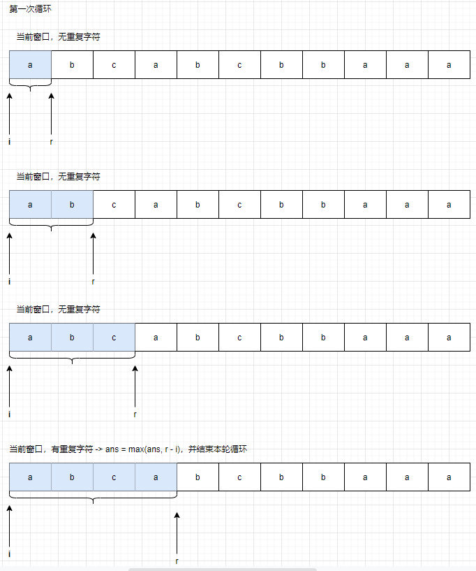
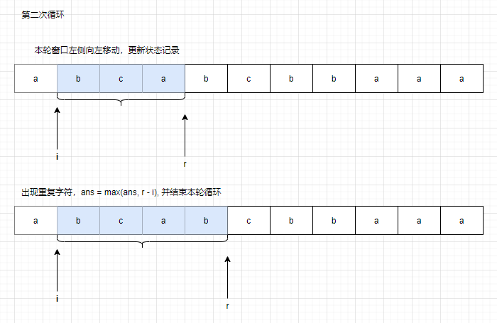

# [3. 无重复字符的最长子串](https://leetcode.cn/problems/longest-substring-without-repeating-characters/)

## 题目描述

给定一个字符串 `s` ，请你找出其中不含有重复字符的 **最长子串** 的长度。

**示例 1:**

```
输入: s = "abcabcbb"
输出: 3 
解释: 因为无重复字符的最长子串是 "abc"，所以其长度为 3。
```

**示例 2:**

```
输入: s = "bbbbb"
输出: 1
解释: 因为无重复字符的最长子串是 "b"，所以其长度为 1。
```

**示例 3:**

```
输入: s = "pwwkew"
输出: 3
解释: 因为无重复字符的最长子串是 "wke"，所以其长度为 3。
     请注意，你的答案必须是 子串 的长度，"pwke" 是一个子序列，不是子串。
```

**提示：**

- `0 <= s.length <= 5 * 104`
- `s` 由英文字母、数字、符号和空格组成

## 解题思路

滑动窗口的核心要点是：

- 大窗口的结果一定比小窗口更好，这样 r 才不会左移
- 窗口的信息可以进行复用，这样 r 在向右移动一次之后，能很快计算出来新的窗口的状态信息

滑动窗口的过程如下：





时间复杂度：O(N), 空间复杂度：O(1)

## 解题代码

```java
class Solution {
    public int lengthOfLongestSubstring(String ss) {
        char[] s = ss.toCharArray();
        int n = s.length;
        int r = 0;
        int ans = 0;
        int start = 0, end = 0;
        int[] cache = new int[1000];
        for (int i = 0; i < n; i++) {
            if (i != 0) {
                cache[s[i - 1]]--;
            }
            while (r < n && cache[s[r]] == 0) {
                cache[s[r]]++;
                r++;
            }
            ans = max(ans, r - i);
        }
        return ans;
    }
    int max(int x, int y) {
        return x > y ? x : y;
    }
}
```

## 举一反三

- [76. 最小覆盖子串](https://leetcode.cn/problems/minimum-window-substring)
- [209. 长度最小的子数组](https://leetcode.cn/problems/minimum-size-subarray-sum)

# [206. 反转链表](https://leetcode.cn/problems/reverse-linked-list)

## 题目描述

Case 1:

给你单链表的头节点 `head` ，请你反转链表，并返回反转后的链表。


```
输入：head = [1,2,3,4,5]
输出：[5,4,3,2,1]
```

Case 2:


```
输入：head = [1,2]
输出：[2,1]
```

Case 3：

```
输入：head = []
输出：[]
```

## 解题思路

所有的链表题目，最重要的是，要有一个伪造的头节点。

这道题目属于模板题目，没有技巧可言，背下来就好了。

```java
    ListNode reverse(ListNode head, ListNode tail) {
        ListNode p = head;
        ListNode q = tail;
        while (p != tail) {
            ListNode s = p.next;
            p.next = q;
            q = p;
            p = s;
        }
        return q;
    }
```

## 解题代码

```java
/**
 * Definition for singly-linked list.
 * public class ListNode {
 *     int val;
 *     ListNode next;
 *     ListNode() {}
 *     ListNode(int val) { this.val = val; }
 *     ListNode(int val, ListNode next) { this.val = val; this.next = next; }
 * }
 */
class Solution {
    public ListNode reverseList(ListNode head) {
        return reverse(head, null);
    }
    ListNode reverse(ListNode head, ListNode tail) {
        ListNode p = head;
        ListNode q = tail;
        while (p != tail) {
            ListNode s = p.next;
            p.next = q;
            q = p;
            p = s;
        }
        return q;
    }
}
```

## 举一反三

- [92. 反转链表 II](https://leetcode.cn/problems/reverse-linked-list-ii/)
- [25. K 个一组翻转链表](https://leetcode.cn/problems/reverse-nodes-in-k-group)
- [21. 合并两个有序链表](https://leetcode.cn/problems/merge-two-sorted-lists)

# [146. LRU 缓存](https://leetcode.cn/problems/lru-cache/)

## 题目描述

请你设计并实现一个满足 [LRU (最近最少使用) 缓存](https://baike.baidu.com/item/LRU) 约束的数据结构。

实现 `LRUCache` 类：

- `LRUCache(int capacity)` 以 **正整数** 作为容量 `capacity` 初始化 LRU 缓存
- `int get(int key)` 如果关键字 `key` 存在于缓存中，则返回关键字的值，否则返回 `-1` 。
- `void put(int key, int value)` 如果关键字 `key` 已经存在，则变更其数据值 `value` ；如果不存在，则向缓存中插入该组 `key-value` 。如果插入操作导致关键字数量超过 `capacity` ，则应该 **逐出** 最久未使用的关键字。

函数 `get` 和 `put` 必须以 `O(1)` 的平均时间复杂度运行。

**示例：**

```
输入
["LRUCache", "put", "put", "get", "put", "get", "put", "get", "get", "get"]
[[2], [1, 1], [2, 2], [1], [3, 3], [2], [4, 4], [1], [3], [4]]
输出
[null, null, null, 1, null, -1, null, -1, 3, 4]

解释
LRUCache lRUCache = new LRUCache(2);
lRUCache.put(1, 1); // 缓存是 {1=1}
lRUCache.put(2, 2); // 缓存是 {1=1, 2=2}
lRUCache.get(1);    // 返回 1
lRUCache.put(3, 3); // 该操作会使得关键字 2 作废，缓存是 {1=1, 3=3}
lRUCache.get(2);    // 返回 -1 (未找到)
lRUCache.put(4, 4); // 该操作会使得关键字 1 作废，缓存是 {4=4, 3=3}
lRUCache.get(1);    // 返回 -1 (未找到)
lRUCache.get(3);    // 返回 3
lRUCache.get(4);    // 返回 4
```

## 解题思路

使用 HashMap + 链表结合的方式来进行本题目的完成

或者直接继承 LinkedHashMap, 需要注意的是，需要重写 removeEldestEntry(Map.Entry<Integer, Integer> eldest) 方法

## 解题代码

```java
class LRUCache extends LinkedHashMap<Integer, Integer>{
    private int capacity;
    
    public LRUCache(int capacity) {
        super(capacity, 0.75F, true);
        this.capacity = capacity;
    }

    public int get(int key) {
        return super.getOrDefault(key, -1);
    }

    public void put(int key, int value) {
        super.put(key, value);
    }

    @Override
    protected boolean removeEldestEntry(Map.Entry<Integer, Integer> eldest) {
        return size() > capacity; 
    }
}
```

```java
class LRUCache {
    class Node {
        int key, val;
        Node next;
        Node prev;
    }
    Node head, tail;
    HashMap<Integer, Node> cache;
    int capacity;
    int size;
    public LRUCache(int capacity) {
        head = new Node();
        tail = new Node();
        head.next = tail;
        tail.prev = head;
        this.capacity = capacity;
        size = 0;
        cache = new HashMap<Integer, Node>(capacity);
    }
    void moveHead(Node node) {
        node.prev.next = node.next;
        node.next.prev = node.prev;
        node.next = head.next;
        head.next.prev = node;
        node.prev = head;
        head.next = node;
    }
    public int get(int key) {
        Node node = cache.get(key);
        if (node == null) {
            return -1;
        } else {
            moveHead(node);
            return node.val;
        }
    }
    public void put(int key, int value) {
        Node node = cache.get(key);
        if (node == null) {
            node = new Node();
            node.key = key;
            node.val = value;
            node.next = head.next;
            head.next.prev = node;
            node.prev = head;
            head.next = node;
            cache.put(key, node);
            size++;
            if (size > capacity) {
                cache.remove(tail.prev.key);
                tail.prev = tail.prev.prev;
                tail.prev.next = tail;
            }
        } else {
            node.val = value;
            cache.put(key, node);
            moveHead(node);
        }
    }
}
```

## 举一反三

- [LFU 缓存](https://leetcode.cn/problems/lfu-cache/)

# [215. 数组中的第K个最大元素](https://leetcode.cn/problems/kth-largest-element-in-an-array/)

## 题目描述

给定整数数组 `nums` 和整数 `k`，请返回数组中第 `k` 个最大的元素。

请注意，你需要找的是数组排序后的第 `k` 个最大的元素，而不是第 `k` 个不同的元素。

你必须设计并实现时间复杂度为 `O(n)` 的算法解决此问题。

**示例 1:**

```
输入: [3,2,1,5,6,4], k = 2
输出: 5
```

**示例 2:**

```
输入: [3,2,3,1,2,4,5,5,6], k = 4
输出: 4
```

## 解题思路

可以使用快速排序的办法，或者使用堆排序的办法。

快速排序的办法就是利用快速排序的分割函数每次都能讲数组分割为以中心轴为界，一侧全部大于另一侧的格式。

堆排序的办法就是小顶堆，如果本元素大于小顶堆或者小顶堆中的元素个数小于 `k` ，那么放入，否则无视就可以了。

## 解题代码

```java
class Solution {
    public int findKthLargest(int[] nums, int k) {
        return find(nums, 0, nums.length - 1, k);
    }
    int find(int[] nums, int l, int r, int k) {
        int idx = partition(nums, l, r);
        if (idx == k - 1) {
            return nums[idx];
        } else if (idx < k - 1) {
            return find(nums, idx + 1, r, k);
        } else {
            return find(nums, l, idx - 1, k);
        }
    }
    int partition(int[] nums, int l, int r) {
        int p = nums[l];
        while (l < r) {
            while (l < r && nums[r] <= p) r--;
            nums[l] = nums[r];
            while (l < r && nums[l] > p) l++;
            nums[r] = nums[l];
        }
        nums[l] = p;
        return l;
    }
}
```

```java
class Solution {
    public int findKthLargest(int[] nums, int k) {
        buildHeap(nums, k);
        for (int i = k; i < nums.length; i++) {
            if (nums[i] > nums[0]) {
                nums[0] = nums[i];
                heapify(nums, 0, k);
            }
        }
        return nums[0];
    }
    void buildHeap(int[] arr, int n) {
        for (int i = (n - 1) / 2; i >= 0; i--) {
            heapify(arr, i, n);
        }
    }
    void heapify(int[] arr, int i, int n) {
        int mini = i;
        int l = 2 * i + 1;
        int r = 2 * i + 2;
        if (l < n && arr[l] < arr[mini]) mini = l;
        if (r < n && arr[r] < arr[mini]) mini = r;
        if (mini != i) {
            swap(arr, i, mini);
            heapify(arr, mini, n);
        }
    }
    void swap(int[] arr, int x, int y) {
        int t = arr[x];
        arr[x] = arr[y];
        arr[y] = t;
    }
}
```

## 举一反三

- [347. 前 K 个高频元素](https://leetcode.cn/problems/top-k-frequent-elements/)

> 如果没有特殊说明，堆的实现一般使用现成的 PriorityQueue 来进行实现，而不是自己重新写一个

- [414. 第三大的数](https://leetcode.cn/problems/third-maximum-number/)
- [703. 数据流中的第 K 大元素](https://leetcode.cn/problems/kth-largest-element-in-a-stream/)
- [973. 最接近原点的 K 个点](https://leetcode.cn/problems/k-closest-points-to-origin/)

# [25. K 个一组翻转链表](https://leetcode.cn/problems/reverse-nodes-in-k-group/)

## 题目描述

给你链表的头节点 `head` ，每 `k` 个节点一组进行翻转，请你返回修改后的链表。

`k` 是一个正整数，它的值小于或等于链表的长度。如果节点总数不是 `k` 的整数倍，那么请将最后剩余的节点保持原有顺序。

你不能只是单纯的改变节点内部的值，而是需要实际进行节点交换。

 

**示例 1：**


```
输入：head = [1,2,3,4,5], k = 2
输出：[2,1,4,3,5]
```

**示例 2：**


```
输入：head = [1,2,3,4,5], k = 3
输出：[3,2,1,4,5]
```

## 解题思路

使用俩个指针分别标识当前需要反转的头节点和尾节点，进行反转

使用一个假头节点，来记录答案。

**所有链表的题目，使用假头节点都会容易分析**

链表反转模板：

```java
ListNode Reverse(ListNode head, ListNode tail) {
    ListNode p = head, q = tail;
    while (p != tail) {
        ListNode s = p.next;
        p.next = q;
        q = p;
        p = s;
    }
    return q;
}
```

## 解题代码

```java
/**
 * Definition for singly-linked list.
 * public class ListNode {
 *     int val;
 *     ListNode next;
 *     ListNode() {}
 *     ListNode(int val) { this.val = val; }
 *     ListNode(int val, ListNode next) { this.val = val; this.next = next; }
 * }
 */
class Solution {
    public ListNode reverseKGroup(ListNode head, int k) {
        ListNode dummyHead = new ListNode();
        dummyHead.next = head;
        ListNode start = head;
        ListNode end = head;
        ListNode rear = dummyHead;
        while (start != null) {
            int i = 0;
            for (i = 0; end != null && i < k; i++) {
                end = end.next;
            }
            if (i < k) break;
            rear.next = reverse(start, end);
            rear = start;
            start = end;
        }
        return dummyHead.next;
    }
    ListNode reverse(ListNode head, ListNode tail) {
        ListNode p = head;
        ListNode q = tail;
        while (p != tail) {
            ListNode s = p.next;
            p.next = q;
            q = p;
            p = s;
        }
        return q;
    }
}
```

## 举一反三

- [两两交换链表中的节点](https://leetcode.cn/problems/swap-nodes-in-pairs/)

可以使用递归，这样的思路更加清晰

# [15. 三数之和](https://leetcode.cn/problems/3sum)

## 题目描述

给你一个整数数组 `nums` ，判断是否存在三元组 `[nums[i], nums[j], nums[k]]` 满足 `i != j`、`i != k` 且 `j != k` ，同时还满足 `nums[i] + nums[j] + nums[k] == 0` 。请你返回所有和为 `0` 且不重复的三元组。

**注意：**答案中不可以包含重复的三元组。

**示例 1：**

```
输入：nums = [-1,0,1,2,-1,-4]
输出：[[-1,-1,2],[-1,0,1]]
解释：
nums[0] + nums[1] + nums[2] = (-1) + 0 + 1 = 0 。
nums[1] + nums[2] + nums[4] = 0 + 1 + (-1) = 0 。
nums[0] + nums[3] + nums[4] = (-1) + 2 + (-1) = 0 。
不同的三元组是 [-1,0,1] 和 [-1,-1,2] 。
注意，输出的顺序和三元组的顺序并不重要。
```

**示例 2：**

```
输入：nums = [0,1,1]
输出：[]
解释：唯一可能的三元组和不为 0 。
```

**示例 3：**

```
输入：nums = [0,0,0]
输出：[[0,0,0]]
解释：唯一可能的三元组和为 0 。
```

## 解题思路

朴素的思路是枚举 `i`，`j`，`k` 的值，这样就是三重循环，时间复杂度是 `O(n * n * n)`

如果数组是有序的，那么我们只需要枚举 `i`, `j`就能够轻松使用二分查找找到数组中是否存在`k`。时间复杂度是 `O(n * n * logn)`

但是，如果数组是有序的，这个题目就和 `俩数之和` 联系起来了。时间复杂度降低为 `O(n * n)`

注意：由于要求不能有重复的集合，所以我们需要判断 `nums[i]` 和 `nums[i - 1]` 的关系，如果俩者相等，那么需要，这是因为 `j` 和 `k` 的搜索范围变小，但是目标值不变，所以一定会出现重复。

## 解题代码

```java
class Solution {
    public List<List<Integer>> threeSum(int[] nums) {
        List<List<Integer>> ans = new ArrayList<>();
        Arrays.sort(nums);
        int n = nums.length;
        for (int i = 0; i < n; i++) {
            if (i != 0 && nums[i] == nums[i - 1]) continue;
            for (int j = i + 1, k = n - 1; j < k; ) {
                if (nums[i] + nums[j] + nums[k] == 0) {
                    ArrayList<Integer> t = new ArrayList<>();
                    t.add(nums[i]); 
                    t.add(nums[j]);
                    t.add(nums[k]);
                    ans.add(t);
                    int idx = j;
                    while (idx < n && nums[idx] == nums[j]) idx++;
                    j = idx;
                } else if (nums[i] + nums[j] + nums[k] < 0) {
                    j++;
                } else {
                    k--;
                }
            }
        }
        return ans;
    }
}
```

## 举一反三

- [1. 两数之和](https://leetcode.cn/problems/two-sum/)

可以使用哈希表或者排序之后再进行查找的方法

- [16. 最接近的三数之和](https://leetcode.cn/problems/3sum-closest/)

和本题差不多，计算出三个数字的和之后呢，需要进行计算比较才能得出答案。

- [18. 四数之和](https://leetcode.cn/problems/4sum/)

> 去重问题的考虑：我们有四个指针 `i`, `j`, `k`, `p`, 我们枚举 `i`, `j`, 那么 `k`, `p` 这俩个指针的范围也是在不断进行缩小的，所以只要保证 `i` `j` 不重复就可以了。`nums[i] == nums[i - 1] || nums[j] == nums[j - 1]` 的时候，跳过本次枚举。

# [53. 最大子序和](https://leetcode.cn/problems/maximum-subarray)

## 题目描述

给你一个整数数组 `nums` ，请你找出一个具有最大和的连续子数组（子数组最少包含一个元素），返回其最大和。

**子数组**是数组中的一个连续部分。

**示例 1：**

```
输入：nums = [-2,1,-3,4,-1,2,1,-5,4]
输出：6
解释：连续子数组 [4,-1,2,1] 的和最大，为 6 。
```

**示例 2：**

```
输入：nums = [1]
输出：1
```

**示例 3：**

```
输入：nums = [5,4,-1,7,8]
输出：23
```

## 解题思路

贪心是特殊的`dp`, 我们设置 `dp[i]` 的状态标识为 以 `i` 结尾的最大子序的和。

`dp[i] = max(dp[i - 1] + nums[i], nums[i])`

由于我们的状态转移方程中只使用到了 `dp[i - 1]`，所以我们可以使用一个临时变量来进行记录，而不用开辟一个数组。

## 解题代码

```java
class Solution {
    int inf = 0x3f_3f_3f_3f;
    public int maxSubArray(int[] nums) {
        int n = nums.length;
        int s = 0;
        int ans = -inf;
        for (int i = 0; i < n; i++) {
            if (s < 0) s = 0;
            s = s + nums[i];
            ans = max(ans, s);
        }
        return ans;
    }
    int max(int x, int y) {
        return x > y ? x : y;
    }
}
```

## 举一反三

- [买卖股票的最佳时机](https://leetcode.cn/problems/best-time-to-buy-and-sell-stock/)
- [乘积最大子数组](https://leetcode.cn/problems/maximum-product-subarray/)

# [ 21. 合并两个有序链表](https://leetcode.cn/problems/merge-two-sorted-lists)

## 题目描述

将两个升序链表合并为一个新的 **升序** 链表并返回。新链表是通过拼接给定的两个链表的所有节点组成的。 

**示例 1：**


```
输入：l1 = [1,2,4], l2 = [1,3,4]
输出：[1,1,2,3,4,4]
```

**示例 2：**

```
输入：l1 = [], l2 = []
输出：[]
```

**示例 3：**

```
输入：l1 = [], l2 = [0]
输出：[0]
```

## 解题思路

合并有序链表是模板题目，直接背诵就好了

## 解题代码

```java
/**
 * Definition for singly-linked list.
 * public class ListNode {
 *     int val;
 *     ListNode next;
 *     ListNode() {}
 *     ListNode(int val) { this.val = val; }
 *     ListNode(int val, ListNode next) { this.val = val; this.next = next; }
 * }
 */
class Solution {
    public ListNode mergeTwoLists(ListNode p1, ListNode p2) {
        ListNode dummyHead = new ListNode();
        ListNode p = dummyHead;
        while (p1 != null && p2 != null) {
            if (p1.val < p2.val) {
                p.next = p1;
                p1 = p1.next;
                p = p.next;
            } else {
                p.next = p2;
                p2 = p2.next;
                p = p.next;
            }
        }
        if (p1 != null) {
            p.next = p1;
        }
        if (p2 != null) {
            p.next = p2;
        }
        return dummyHead.next;
    }
}
```

## 举一反三

- [23. 合并 K 个升序链表](https://leetcode.cn/problems/merge-k-sorted-lists/)

使用归并排序

- [88. 合并两个有序数组](https://leetcode.cn/problems/merge-sorted-array/)
- [148. 排序链表](https://leetcode.cn/problems/sort-list/)

# [1. 两数之和](https://leetcode.cn/problems/two-sum)

## 题目描述

给定一个整数数组 `nums` 和一个整数目标值 `target`，请你在该数组中找出 **和为目标值** `target` 的那 **两个** 整数，并返回它们的数组下标。

你可以假设每种输入只会对应一个答案。但是，数组中同一个元素在答案里不能重复出现。

你可以按任意顺序返回答案。

**示例 1：**

```
输入：nums = [2,7,11,15], target = 9
输出：[0,1]
解释：因为 nums[0] + nums[1] == 9 ，返回 [0, 1] 。
```

**示例 2：**

```
输入：nums = [3,2,4], target = 6
输出：[1,2]
```

**示例 3：**

```
输入：nums = [3,3], target = 6
输出：[0,1]
```

## 解题思路

使用`HashMap`进行记录已经有的数字，可以很快的判断出来是否存在俩个数字之和等于目标值。

## 解题代码

```java
class Solution {
    public int[] twoSum(int[] nums, int target) {
        HashMap<Integer, Integer> map = new HashMap<>();
        int n = nums.length;
        for (int i = 0; i < n; i++) {
            if (map.containsKey(target - nums[i])) {
                return new int[]{i, map.get(target - nums[i])};
            } 
            map.put(nums[i], i);
        }
        return new int[] {-1, -1};
    }
}
```

## 举一反三

- [两数之和 II - 输入有序数组](https://leetcode.cn/problems/two-sum-ii-input-array-is-sorted/)
- [和为 K 的子数组](https://leetcode.cn/problems/subarray-sum-equals-k/)

# [ 5. 最长回文子串](https://leetcode.cn/problems/longest-palindromic-substring)

## 题目描述

给你一个字符串 `s`，找到 `s` 中最长的回文子串。

如果字符串的反序与原始字符串相同，则该字符串称为回文字符串。

 **示例 1：**

```
输入：s = "babad"
输出："bab"
解释："aba" 同样是符合题意的答案。
```

**示例 2：**

```
输入：s = "cbbd"
输出："bb"
```

## 解题思路

- 使用中心扩展算法
- 使用 `manacher` 算法，这个算法的核心思想就是利用已有的对称位置的关系

## 解题代码

```
class Solution {
    public String longestPalindrome(String ss) {
        char[] s = ss.toCharArray();
        StringBuilder sb = new StringBuilder();
        int n = s.length;
        sb.append("#");
        for (int i = 0; i < n; i++) {
            sb.append(s[i]);
            sb.append("#");
        }
        s = sb.toString().toCharArray();
        n = s.length;
        int[] p = new int[n];
        int c = -1, r = -1;
        int maxLen = 0;
        int start = -1, end = -1;
        for (int i = 0; i < n; i++) {
            if (i < r) {
                p[i] = Math.min(p[2 * c - i], r - i);
            } else {
                p[i] = 1;
            }
            while (i + p[i] < n && i - p[i] >= 0 && s[i - p[i]] == s[i + p[i]]) {
                p[i]++;
            }
            if (i + p[i] > r) {
                c = i;
                r = i + p[i];
            }
            if (p[i] > maxLen) {
                maxLen = p[i];
                start = i - p[i] + 1;
                end = i + p[i] - 1;
            }
        }
        sb = new StringBuilder();
        for (int i = start; i <= end; i++) {
            if (s[i] != '#') {
                sb.append(s[i]);
            }
        }
        return sb.toString();
    }
}
```

## 一举反三

- [回文子串](https://leetcode.cn/problems/palindromic-substrings/)
- [516. 最长回文子序列](https://leetcode.cn/problems/longest-palindromic-subsequence/)

> 使用二维dp
>
> dp [ i ] [ j ] = s[i] == s[j] && dp[i + 1] [j - 1] + 2 || s[i] != s[j] && max(dp[i + 1] [j], dp[i] [j - 1])   

