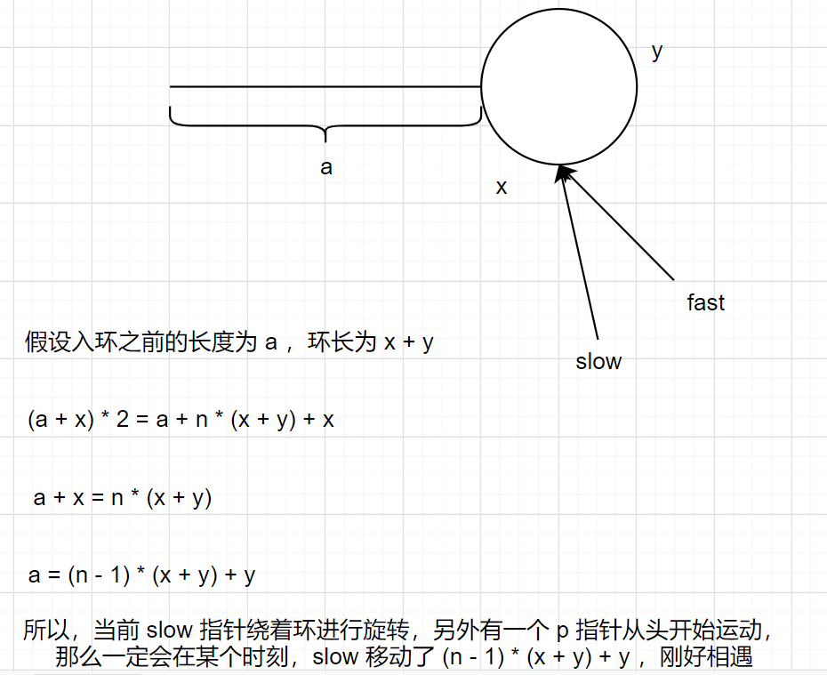

# [102. 二叉树的层序遍历](https://leetcode.cn/problems/binary-tree-level-order-traversal)

## 题目描述

给你二叉树的根节点 `root` ，返回其节点值的 **层序遍历** 。 （即逐层地，从左到右访问所有节点）。

**示例 1：**


```
输入：root = [3,9,20,null,null,15,7]
输出：[[3],[9,20],[15,7]]
```

**示例 2：**

```
输入：root = [1]
输出：[[1]]
```

**示例 3：**

```
输入：root = []
输出：[]
```

## 解题思路

二叉树的层次遍历，类似于模板题目，本质上是广度优先遍历的思想。

使用一个辅助队列，来进行遍历。

## 解题代码

```java
/**
 * Definition for a binary tree node.
 * public class TreeNode {
 *     int val;
 *     TreeNode left;
 *     TreeNode right;
 *     TreeNode() {}
 *     TreeNode(int val) { this.val = val; }
 *     TreeNode(int val, TreeNode left, TreeNode right) {
 *         this.val = val;
 *         this.left = left;
 *         this.right = right;
 *     }
 * }
 */
class Solution {
    public List<List<Integer>> levelOrder(TreeNode root) {
        List<List<Integer>> ans = new ArrayList<>();
        if (root == null) return ans;
        LinkedList<TreeNode> q = new LinkedList<>();
        q.add(root);
        while (!q.isEmpty()) {
            int len = q.size();
            ArrayList<Integer> tmp = new ArrayList<>();
            for (int i = 0; i < len; i++) {
                TreeNode t = q.poll();
                tmp.add(t.val);
                if (t.left != null) q.add(t.left);
                if (t.right != null) q.add(t.right);
            }
            ans.add(tmp);
        }
        return ans;
    }
}
```

## 举一反三

- [107. 二叉树的层序遍历 II](https://leetcode.cn/problems/binary-tree-level-order-traversal-ii/)
- [103. 二叉树的锯齿形层序遍历](https://leetcode.cn/problems/binary-tree-zigzag-level-order-traversal/)
- [429. N 叉树的层序遍历](https://leetcode.cn/problems/n-ary-tree-level-order-traversal/)
- <font color ="red">[297. 二叉树的序列化与反序列化](https://leetcode.cn/problems/serialize-and-deserialize-binary-tree/)</font> 

> 先序遍历二叉树的序列化和反序列化的过程


# [33. 搜索旋转排序数组](https://leetcode.cn/problems/search-in-rotated-sorted-array)

## 题目描述

整数数组 `nums` 按升序排列，数组中的值 **互不相同** 。

在传递给函数之前，`nums` 在预先未知的某个下标 `k`（`0 <= k < nums.length`）上进行了 **旋转**，使数组变为 `[nums[k], nums[k+1], ..., nums[n-1], nums[0], nums[1], ..., nums[k-1]]`（下标 **从 0 开始** 计数）。例如， `[0,1,2,4,5,6,7]` 在下标 `3` 处经旋转后可能变为 `[4,5,6,7,0,1,2]` 。

给你 **旋转后** 的数组 `nums` 和一个整数 `target` ，如果 `nums` 中存在这个目标值 `target` ，则返回它的下标，否则返回 `-1` 。

你必须设计一个时间复杂度为 `O(log n)` 的算法解决此问题。

**示例 1：**

```
输入：nums = [4,5,6,7,0,1,2], target = 0
输出：4
```

**示例 2：**

```
输入：nums = [4,5,6,7,0,1,2], target = 3
输出：-1
```

**示例 3：**

```
输入：nums = [1], target = 0
输出：-1
```

**提示：**

- `1 <= nums.length <= 5000`
- `-104 <= nums[i] <= 104`
- `nums` 中的每个值都 **独一无二**
- 题目数据保证 `nums` 在预先未知的某个下标上进行了旋转
- `-104 <= target <= 104`

## 解题思路

这个题目的意思就是有一段有序的数组，将数组的一部分从后面移动到前面去，这样怎么进行高效查找？

思路是这样的：

- 找到前一部分有序和后一部分有序的分界点
- 判断需要查找的数字在前一部分还是后一部分
- 对那一部分进行二分查找

第二种思路：

- 如果 `nums[l] < nums[mid]`， 说明前一部分有序，如果 `target in nums[l] ~ nums[mid]`，那么在前一部分查找，否则在后一部分查找
- 如果`nums[l] > nums[mid]`，说明后一部分有序，如果`target in nums[mid] ~ nums[r]`，那么在后一部分查找，否则在前一部分查找

## 解题代码

```java
class Solution {
    public int search(int[] nums, int target) {
        int n = nums.length;
        int l = 0, r = n - 1; 
        int idx = findRMax(nums, 0, n - 1, nums[0]);
        if (target >= nums[0]) {
            r = idx;
        } else {
            l = idx + 1;
        }
        while (l <= r) {
            int mid = (l + r) / 2;
            if (nums[mid] == target) {
                return mid;
            } else if (nums[mid] > target) {
                r = mid - 1;
            } else {
                l = mid + 1;
            }
        }
        return -1;
    }
    int findRMax(int[] nums, int l, int r, int target) {
        int ans = -1;
        while (l <= r) {
            int mid = (l + r) / 2;
            if (nums[mid] >= target) {
                ans = mid;
                l = mid + 1;
            } else {
                r = mid - 1;
            }
        }
        return ans;
    }
}
```

```java
class Solution {
    public int search(int[] nums, int target) {
        int n = nums.length;
        if (n == 0) {
            return -1;
        }
        if (n == 1) {
            return nums[0] == target ? 0 : -1;
        }
        int l = 0, r = n - 1;
        while (l <= r) {
            int mid = (l + r) / 2;
            if (nums[mid] == target) {
                return mid;
            }
            if (nums[0] <= nums[mid]) {
                if (nums[0] <= target && target < nums[mid]) {
                    r = mid - 1;
                } else {
                    l = mid + 1;
                }
            } else {
                if (nums[mid] < target && target <= nums[n - 1]) {
                    l = mid + 1;
                } else {
                    r = mid - 1;
                }
            }
        }
        return -1;
    }
}
```

## 举一反三

- [搜索旋转排序数组 II](https://leetcode.cn/problems/search-in-rotated-sorted-array-ii/)

如果 `nums[l] == nums[mid] == nums[r]`，那么无法判定哪边是有序的，所以`l++, r--`，缩小搜索范围

- [寻找旋转排序数组中的最小值](https://leetcode.cn/problems/find-minimum-in-rotated-sorted-array/)

# [200. 岛屿数量](https://leetcode.cn/problems/number-of-islands)

## 题目描述

给你一个由 `'1'`（陆地）和 `'0'`（水）组成的的二维网格，请你计算网格中岛屿的数量。

岛屿总是被水包围，并且每座岛屿只能由水平方向和/或竖直方向上相邻的陆地连接形成。

此外，你可以假设该网格的四条边均被水包围。

**示例 1：**

```
输入：grid = [
  ["1","1","1","1","0"],
  ["1","1","0","1","0"],
  ["1","1","0","0","0"],
  ["0","0","0","0","0"]
]
输出：1
```

**示例 2：**

```
输入：grid = [
  ["1","1","0","0","0"],
  ["1","1","0","0","0"],
  ["0","0","1","0","0"],
  ["0","0","0","1","1"]
]
输出：3
```

**提示：**

- `m == grid.length`
- `n == grid[i].length`
- `1 <= m, n <= 300`
- `grid[i][j]` 的值为 `'0'` 或 `'1'`

## 解题思路

这是一道最简单的不带回溯的深度优先搜索题目。

## 解题代码

```java
class Solution {
    boolean[][] vis = new boolean[305][305];
    int[] xx = new int[] {1, -1, 0, 0};
    int[] yy = new int[] {0, 0, 1, -1};
    public int numIslands(char[][] grid) {
        int m = grid.length;
        int n = grid[0].length;
        int ans = 0;
        for (int i = 0; i < m; i++) {
            for (int j = 0; j < n; j++) {
                if (!vis[i][j] && grid[i][j] == '1') {
                    dfs(grid, i, j);
                    ans++;
                }
            }
        }
        return ans;
    }
    void dfs(char[][] grid, int x, int y) {
        int m = grid.length;
        int n = grid[0].length;
        vis[x][y] = true;
        for (int i = 0; i < 4; i++) {
            int nx = x + xx[i];
            int ny = y + yy[i];
            if (nx >= 0 && ny >= 0 && nx < m && ny < n && vis[nx][ny] == false && grid[nx][ny] == '1') {
                dfs(grid, nx, ny);
            }
        }
    }
}
```

## 举一反三

- [岛屿的最大面积](https://leetcode.cn/problems/max-area-of-island/)

使用一个变量记录当前情况下，岛屿的最大面积

- [被围绕的区域](https://leetcode.cn/problems/surrounded-regions/)

将边缘没有被包围的区域进行标记

# [460. LFU 缓存](https://leetcode.cn/problems/lfu-cache/)

## 题目描述

实现 `LFUCache` 类：

- `LFUCache(int capacity)` - 用数据结构的容量 `capacity` 初始化对象
- `int get(int key)` - 如果键 `key` 存在于缓存中，则获取键的值，否则返回 `-1` 。
- `void put(int key, int value)` - 如果键 `key` 已存在，则变更其值；如果键不存在，请插入键值对。当缓存达到其容量 `capacity` 时，则应该在插入新项之前，移除最不经常使用的项。在此问题中，当存在平局（即两个或更多个键具有相同使用频率）时，应该去除 **最久未使用** 的键。

为了确定最不常使用的键，可以为缓存中的每个键维护一个 **使用计数器** 。使用计数最小的键是最久未使用的键。

当一个键首次插入到缓存中时，它的使用计数器被设置为 `1` (由于 put 操作)。对缓存中的键执行 `get` 或 `put` 操作，使用计数器的值将会递增。

函数 `get` 和 `put` 必须以 `O(1)` 的平均时间复杂度运行。

## 解题思路

### 使用 TreeSet

我们在进行缓存的淘汰的时候，策略是：

- 访问频次最低
- 最久未使用

所以使用 `TreeSet` 来保存数据，这样可以根据 `TreeSet` 的有序性来进行排序，时间复杂度达到 `O(logn)`

> 由于涉及到缓存的更新操作，会涉及到不是最小频次的元素的更新。
>
> 所以不能使用优先队列进行存储，因为优先队列只能操作队首的元素

### 使用俩个 HashMap + 双向链表的方式

虽然上述实现的方式比较简单，但是由于题目要求我们设计出一个时间复杂度达到 `O(1)` 的算法。

所以我们考虑使用俩个 `HashMap` 来进行存储。

我们需要一个 `keyTable` 来快速地进行元素的获取操作。

为了快速获取访问频次最低的元素，所以我们维护一个`freq: doubleListNode`这样的数据结构。


**关键问题：**

每次进行访问的时候都需要先删除旧节点的状态，更新为新节点的状态。

## 解题代码

### TreeSet 版，时间复杂度 O(logn)

```java
// 1. Node 设计
class Node implements Comparable<Node> {
    int cnt, time, key, value;
    Node(int cnt, int time, int key, int value) {
        this.cnt = cnt;
        this.time = time;
        this.key = key;
        this.value = value;
    }
    public int compareTo(Node node) {
        return this.cnt != node.cnt ? this.cnt - node.cnt : this.time - node.time; 
    }
    public boolean equals(Object obj) {
        if (this == obj) return true;
        if (obj == null || this.getClass() != obj.getClass()) return false;
        Node node = (Node)obj;
        return this.cnt == node.cnt && this.time == node.time
            && this.key == node.key && this.value == node.value;
    }
    public int hashCode() {
        return Objects.hash(cnt, time, key, value);
    }
}
// 2. LFU 算法实现
class LFUCache {
	HashMap<Integer, Node> keyTable;
    TreeSet<Node> set;
    int capacity;
    int time;
    public LFUCache(int capacity) {
		this.capacity = capacity;
        this.time = 0;
        keyTable = new HashMap<Integer, Node>();
        set = new TreeSet<Node>();
    }
    
    public int get(int key) {
		// 1. 判断 key 是否存在
        if (keyTable.containsKey(key) == false) {
            return -1;
        }
        // 2. 删除旧值
        Node cache = keyTable.get(key);
        set.remove(cache);
        // 3. 更新
        cache.cnt++;
        cache.time = ++time;
        set.add(cache);
        keyTable.put(key, cache);
        return cache.value;
    }
   
    public void put(int key, int value) {
		// 1. 判断 key 是否存在
        if (keyTable.containsKey(key) == false) {
            // 1. 如果容量满了
            if (keyTable.size() == capacity) {
            	// 2. 删除最近最久未使用的元素
                keyTable.remove(set.first().key);
                set.remove(set.first());
            }
            Node cache = new Node(0, ++time, key, value);
            keyTable.put(key, cache);
            set.add(cache);
        } else {
            // 1. 删除旧值
            Node cache = keyTable.get(key);
            set.remove(cache);
            // 2. 更新
            cache.cnt++;
            cache.time = ++time;
            cache.value = value;
            set.add(cache);
            keyTable.put(key, cache);
        }
    }
}
```

### 时间复杂度 O(1)

```java
// 1. 链表节点设计
class Node {
    int key, value, freq;
    Node prev, next;
    Node () {
        this.key = this.value = this.freq = -1;
    }
    Node(int key, int value, int freq) {
        this.key = key;
        this.value = value;
        this.freq = freq;
    }
}
class DoubleLinkedList {
    Node dummyHead, dummyTail;
    int size;
    DoubleLinekdList() {
        dummyHead = new Node();
        dummyTail = new Node();
        dummyHead.next = dummyTail;
        dummyTail.prev = dummyHead;
        size = 0;
    }
    void addFirst(Node node) {
        node.next = dummyHead.next;
        node.prev = dummyHead;
        dummyHead.next.prev = node;
        dummyHead.next = node;
    	size++;
    }
    void remove(Node node) {
        node.next.prev = node.prev;
        node.prev.next = node.next;
        size--;
    }
    Node getHead() {
        return dummyHead.next;
    }
    Node getTail() {
        return dummyTail.prev;
    }
}
// 2. LFU
class LFUCache {
    int minfreq, capacity;
    Map<Integer, Node> keyTable;
    Map<Integer, DoublyLinkedList> freqTable;
    public LFUCache(int capacity) {
        this.minfreq = 0;
        this.capacity = capacity;
        keyTable = new HashMap<Integer, Node>();
        freqTable = new HashMap<Integer, DoublyLinkedList>();
    }
    
    public int get(int key) {
        if (!keyTable.containsKey(key)) {
            return -1;
        }
        Node node = keyTable.get(key);
        int val = node.val, freq = node.freq;
        freqTable.get(freq).remove(node);
        // 如果当前链表为空，我们需要在哈希表中删除，且更新minFreq
        if (freqTable.get(freq).size == 0) {
            freqTable.remove(freq);
            if (minfreq == freq) {
                minfreq += 1;
            }
        }
        // 插入到 freq + 1 中
        DoublyLinkedList list = freqTable.getOrDefault(freq + 1, new DoublyLinkedList());
        list.addFirst(new Node(key, val, freq + 1));
        freqTable.put(freq + 1, list);
        keyTable.put(key, freqTable.get(freq + 1).getHead());
        return val;
    }
    
    public void put(int key, int value) {
        if (!keyTable.containsKey(key)) {
            // 缓存已满，需要进行删除操作
            if (keyTable.size() == capacity) {
                // 通过 minFreq 拿到 freqTable[minFreq] 链表的末尾节点
                Node node = freqTable.get(minfreq).getTail();
                keyTable.remove(node.key);
                freqTable.get(minfreq).remove(node);
                if (freqTable.get(minfreq).size == 0) {
                    freqTable.remove(minfreq);
                }
            }
            DoublyLinkedList list = freqTable.getOrDefault(1, new DoublyLinkedList());
            list.addFirst(new Node(key, value, 1));
            freqTable.put(1, list);
            keyTable.put(key, freqTable.get(1).getHead());
            minfreq = 1;
        } else {
            // 与 get 操作基本一致，除了需要更新缓存的值
            Node node = keyTable.get(key);
            int freq = node.freq;
            freqTable.get(freq).remove(node);
            if (freqTable.get(freq).size == 0) {
                freqTable.remove(freq);
                if (minfreq == freq) {
                    minfreq += 1;
                }
            }
            DoublyLinkedList list = freqTable.getOrDefault(freq + 1, new DoublyLinkedList());
            list.addFirst(new Node(key, value, freq + 1));
            freqTable.put(freq + 1, list);
            keyTable.put(key, freqTable.get(freq + 1).getHead());
        }
    }
}
```

## 举一反三

- [LRU 缓存](https://leetcode.cn/problems/lru-cache/)

# [141. 环形链表](https://leetcode.cn/problems/linked-list-cycle)

## 题目描述

给你一个链表的头节点 `head` ，判断链表中是否有环。

如果链表中有某个节点，可以通过连续跟踪 `next` 指针再次到达，则链表中存在环。 为了表示给定链表中的环，评测系统内部使用整数 `pos` 来表示链表尾连接到链表中的位置（索引从 0 开始）。**注意：`pos` 不作为参数进行传递** 。仅仅是为了标识链表的实际情况。

*如果链表中存在环* ，则返回 `true` 。 否则，返回 `false` 。

**示例 1：**


```
输入：head = [3,2,0,-4], pos = 1
输出：true
解释：链表中有一个环，其尾部连接到第二个节点。
```

**示例 2：**


```
输入：head = [1,2], pos = 0
输出：true
解释：链表中有一个环，其尾部连接到第一个节点。
```

**示例 3：**


```
输入：head = [1], pos = -1
输出：false
解释：链表中没有环。
```

## 解题思路

使用快慢指针的方式，快指针每次比慢指针多走一步，这样相对位置就多一步，所以如果有环，那么俩个指针最终会相遇。

## 解题代码

```java
/**
 * Definition for singly-linked list.
 * class ListNode {
 *     int val;
 *     ListNode next;
 *     ListNode(int x) {
 *         val = x;
 *         next = null;
 *     }
 * }
 */
public class Solution {
    public boolean hasCycle(ListNode head) {
        ListNode slow = head, fast = head;
        while (fast != null && slow != null && fast.next != null) {
            slow = slow.next;
            fast = fast.next.next;
            if (slow == fast) {
                return true;
            }
        }
        return false;
    }
}
```

## 举一反三

- [环形链表 II](https://leetcode.cn/problems/linked-list-cycle-ii/)

这个题目需要一点数学的思维。


